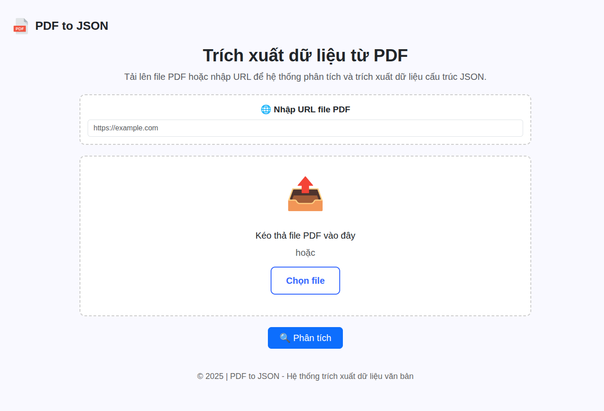
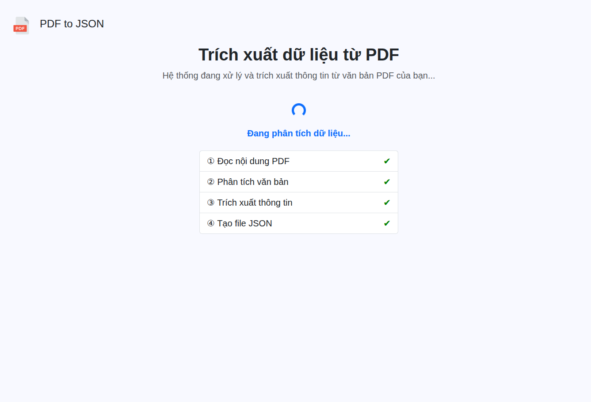

<div id="top"></div>

<div align="center">

<!-- Logo (CC0) -->


# KeyValExtrator

*Trích xuất khóa–giá trị (Key–Value) từ PDF với Python + spaCy + Flask*

<!-- Badges -->

<a href="#"></a> <a href="#"></a> <a href="#"></a> <a href="#"></a>

</div>

---

## Mục lục

* [Tổng quan](#tổng-quan)
* [Ảnh giao diện Web](#ảnh-giao-diện-web)
* [Tính năng](#tính-năng)
* [Cấu trúc dự án](#cấu-trúc-dự-án)

  * [Sơ đồ thư mục](#sơ-đồ-thư-mục)
* [Bắt đầu](#bắt-đầu)

  * [Yêu cầu](#yêu-cầu)
  * [Cài đặt](#cài-đặt)
  * [Chạy ứng dụng](#chạy-ứng-dụng)
  * [Kiểm thử](#kiểm-thử)
* [Lộ trình](#lộ-trình)
* [Đóng góp](#đóng-góp)
* [Giấy phép](#giấy-phép)
* [Ghi nhận](#ghi-nhận)

---

## Tổng quan

**KeyValExtrator** là ứng dụng demo trích xuất các cặp *Key–Value* từ tài liệu PDF (đặc biệt hoá đơn) bằng pipeline:
`PDF → OCR/tiền xử lý → NER → hậu xử lý → JSON/HTML`. Ứng dụng cung cấp giao diện web nhỏ gọn bằng **Flask** để tải lên tệp và xem kết quả.

---

## Ảnh giao diện Web

<p align="center">
  
</p>

<p align="center">
  
</p>

<p align="center">
  
</p>

---

## Tính năng

* Trích xuất trường phổ biến: `POSITION (Chức vụ)`, `REFERENCE (căn cứ)`, `ISSUING_AGENCY (cơ quan ban hành)`, v.v.
* Hỗ trợ PDF dạng text và ảnh (với OCR tuỳ chọn).
* Web UI đơn giản: tải file, theo dõi trạng thái xử lý, xem JSON kết quả.
* Mã nguồn thuần Python, dễ tuỳ biến pipeline (tiền xử lý/hậu xử lý/NER).

---

## Cấu trúc dự án

### Sơ đồ thư mục

```text
KeyValExtrator/
├── app/
│   ├── __init__.py
│   ├── pdf_process.py
│   ├── pdf_utils.py
│   ├── postprocess.py
│   └── utils.py
├── app.py
├── data/
│   ├── clear/
│   └── result/
├── models/
│   └── inference.py
├── ner_model_best/          
│   ├── config.json
│   ├── model.safetensors    
│   ├── sentencepiece.bpe.model
│   ├── special_tokens_map.json
│   ├── tokenizer.json
│   ├── tokenizer_config.json
│   └── training_args.bin
├── requirements.txt
├── static/
│   └── style.css
├── templates/
│   ├── index.html
│   ├── loading.html
│   └── result.html
├── test.ipynb
└── assets/
    ├── logo.svg
    ├── screenshot_ui.png
    └── screenshot_result.png
```

> Các đường dẫn trong README sử dụng **đường dẫn tương đối** để tương thích cả khi chạy cục bộ lẫn khi đẩy lên GitHub.

---

## Bắt đầu

### Yêu cầu

* **Python** 3.9+
* **pip** và (khuyến nghị) **virtualenv** hoặc **conda**
* Đối với OCR từ PDF ảnh: `poppler` (để `pdf2image` hoạt động) và `tesseract-ocr` (kèm gói ngôn ngữ `vie` nếu cần)

### Cài đặt

```bash
# 1) clone mã nguồn
git clone https://github.com/HieuAI2005/KeyValExtrator.git
cd KeyValExtrator

# 2) tạo môi trường ảo (khuyến nghị)
python -m venv .venv
source .venv/bin/activate  # Windows: .venv\Scripts\activate

# 3) cài phụ thuộc
pip install --upgrade pip
pip install -r requirements.txt

# 4) cài thêm công cụ OCR (tuỳ chọn)
# Ubuntu: sudo apt install poppler-utils tesseract-ocr tesseract-ocr-vie
```

### Chạy ứng dụng

```bash
# đặt biến môi trường Flask nếu cần
export FLASK_APP=app.py
export FLASK_ENV=development  # tuỳ chọn

# chạy
python app.py
# hoặc: flask run --host 0.0.0.0 --port 5000
```

Mặc định ứng dụng nghe tại `http://127.0.0.1:5000`.

### Kiểm thử

```bash
pytest -q
```

---

## Lộ trình

* [x] Thiết lập pipeline cơ bản: đọc PDF → NER → JSON.
* [ ] Bảng `table` robust hơn cho nhiều template hóa đơn.
* [ ] Đóng gói Docker + cấu hình hiệu năng.
* [ ] Tài liệu hoá API (REST) để tích hợp hệ thống khác.

---
